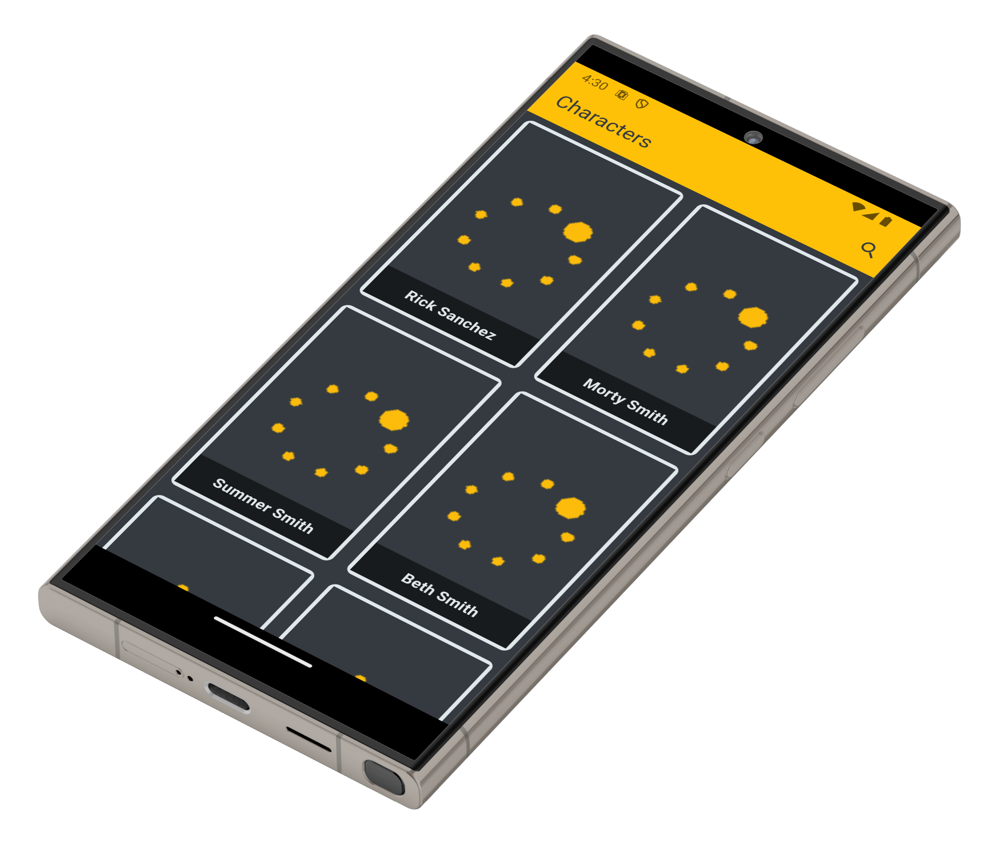
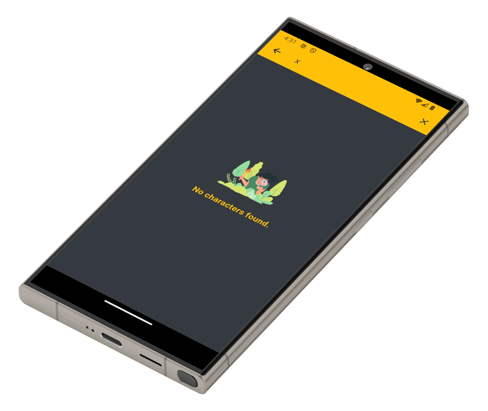
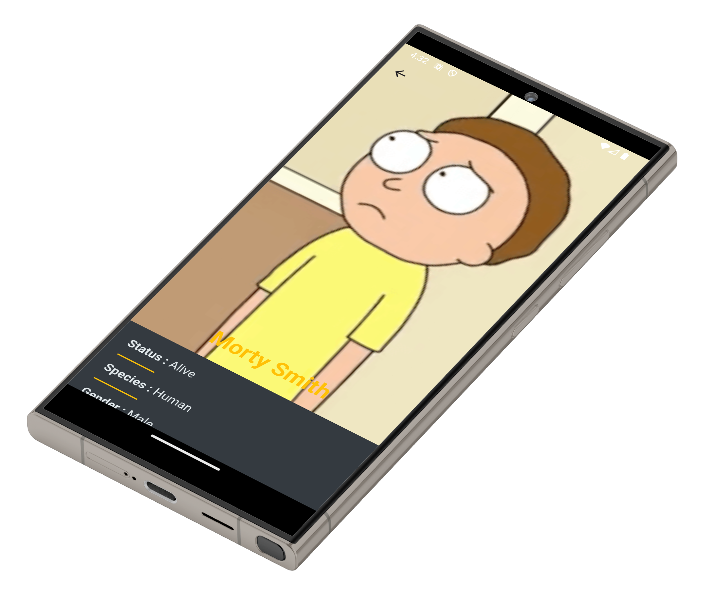
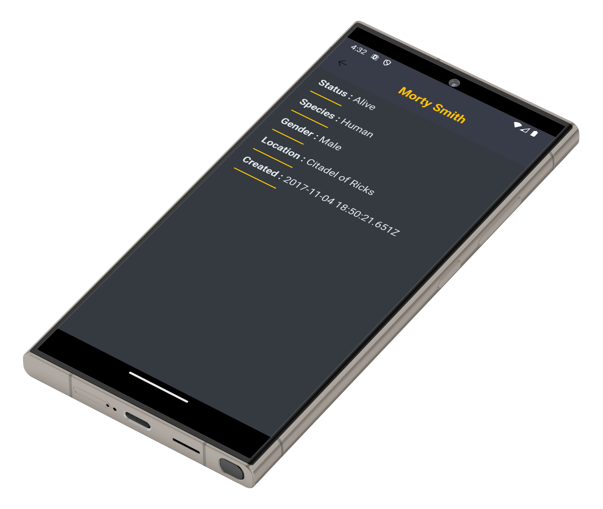

# Rick and Morty Flutter App

A simple Flutter application that displays characters from the [Rick and Morty](https://rickandmortyapi.com/) universe using the Rick and Morty API. The app is built using clean architecture principles and state management with Bloc.

## Features

- 🔍 Search for characters by name
- 👤 View character details
- 🧠 Uses Bloc for state management
- 🌐 Data fetched from [rickandmortyapi.com](https://rickandmortyapi.com/)
- 📱 Responsive and adaptive UI

## 📸 Screenshots

  
  
  
  
  
  

